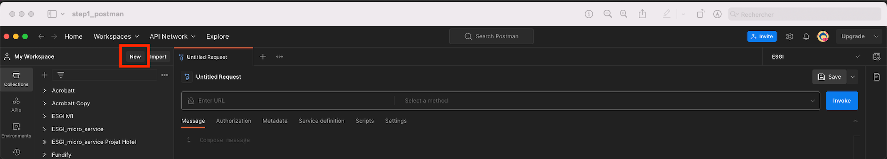
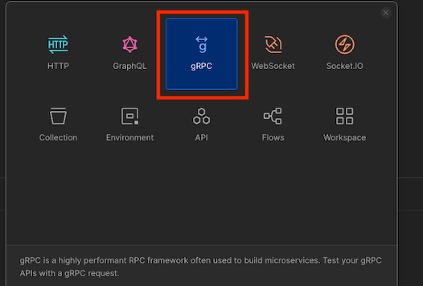
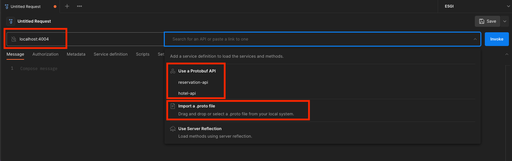
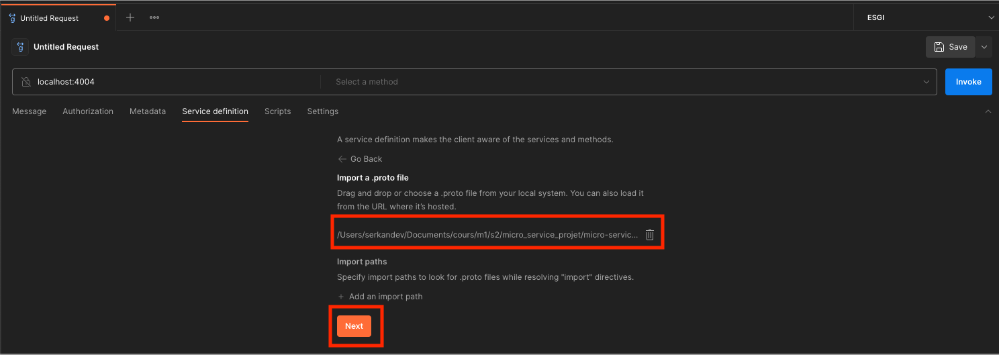
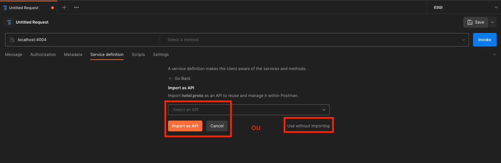

# Comment setup postman pour tester les routes

1. Cliquer sur `New` dans l'onglet "Collections" de postman

2. Choisir le type `gRPC` parmis la liste

3. Indiquez l'URL avec le bon port de votre API.
  Vous pouvez sélectionner les API deja pré-enregistrées sinon vous devez cliquer sur `Import a .proto file` 

4. Vérifiez bien que vous avez choisi le bon fichier proto, cliquer sur `Next`

5. Si vous voulez enregistrer votre API vous pouvez donner un nom et faire `import as API`.
  ℹ️ : Je vous conseil d'importer une fois que vous avez fini entièrement votre API
  Si vous êtes en train de construire votre API, vous devez faire `Use without importing`

6. Vous pouvez maintenant tester vos routes en choissisant la méthode qui vous interesse.